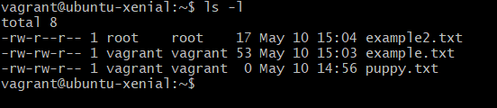

# Bash and Linux Commands

### Here are some common and useful commands used with Bash and Linux:

`touch`
makes a file

e.g.

`$touch example.txt`

would make a file called 'example.txt'.

----

`file`
shows what is in a file

e.g.

`$file example.txt`

would show what is in the file 'example.txt'.

----

`mv`
can be used to rename, move or change a file

e.g.

`$mv example.txt example.jpg`
would change the name of the example.txt file into 'example.jpg'.

----

`cat`
shows what is in a file

e.g.

`$cat example.txt`
would show you what is in the file.

----

`sudo nano`
let's you add to a file

e.g.

`$sudo nano example.txt`
would let you edit the file 'example.txt'.

If the file doesn't already exist, it will create it for you.

----

`Control + X`
to exit

`mkdir`
stands for make directory

e.g.

`$mkdir example`
would make a directory called 'example'.

----

`rm`
stands for remove

e.g.

`$rm example.txt`
would remove the file 'example.txt' from the directory.

You can't use this to remove directories.

----

`-rf`
means that even if a file is open, you will force a removal

e.g.

`$rm -rf`
would remove the entire system.

----

`$rm -rf example`
would remove the directory 'example'.

`mkdir .`
makes a hidden directory

e.g.

`$mkdir .hidden_directory`
would make a directory called 'hidden_directory' which would be hidden.

----

`ls -a`
shows all files in the directory, including those that are hidden

i.e.

`$ls -a`

----

`*`
stands for wildcards, also means all

e.g.

`$ls *.txt`
would show all files ending with '.txt'.

----

`ls -l`
checks permissions on files

e.g.

`$ls -l`
would list all the files and which permissions are granted to different users.

The above image lists the files in the current directory and shows which permissions the three groups of users would have.

`r`
stands for 'read' which means that the user would be able to read the file.

`w`
stands for 'write' which means the user would be able to write, add, edit, the file.

`x`
stands for 'execute' which means the user would be able to run the file.

The first batch of letters show which permissions the owner would have.

The second batch of letters (after the dashes) show which permissions a group might have.

The last batch of letters show which permissions everyone else would have.

----

`chmod +x`
will add execution privileges to the current owner

e.g.

`$chmod u+x example.txt`
will give the current owner user executive privileges for the file 'example.txt'.

----

There are numerical shorthands for privileges...

`chmod 777`
gives all permissions to all users

e.g.

`$chmod 777 example.txt`
would give everyone executive privileges for the file 'example.txt'.