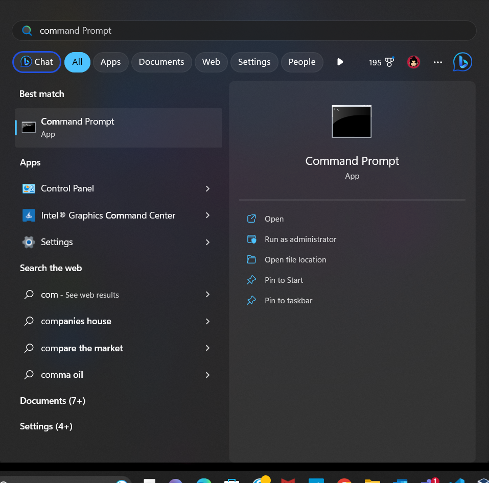
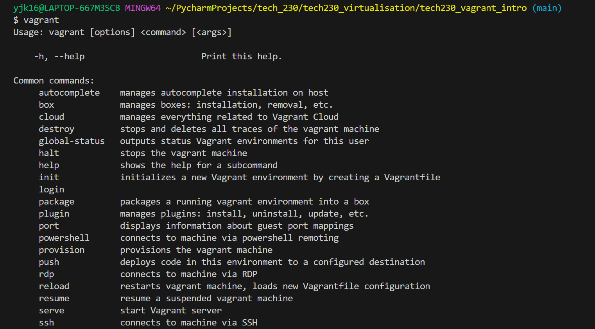
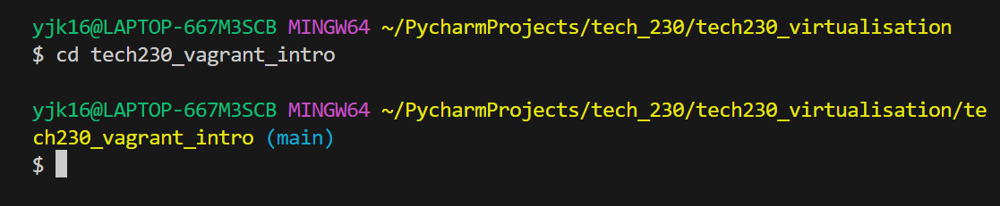
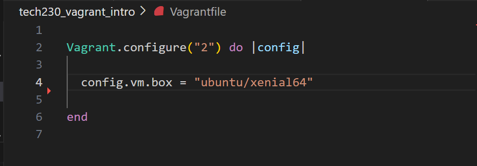
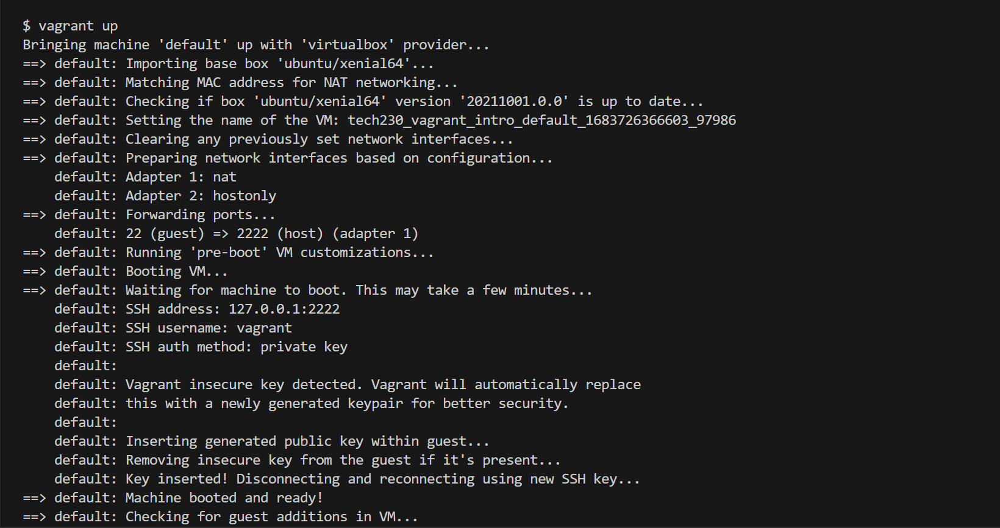
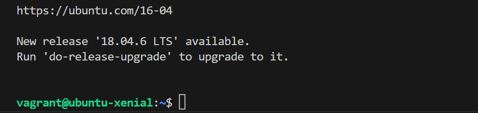
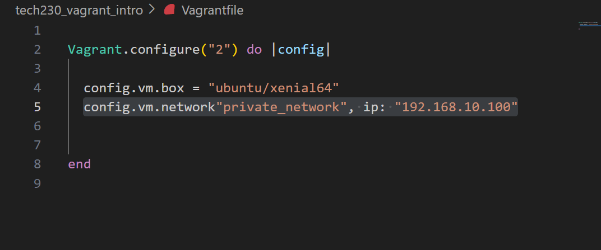
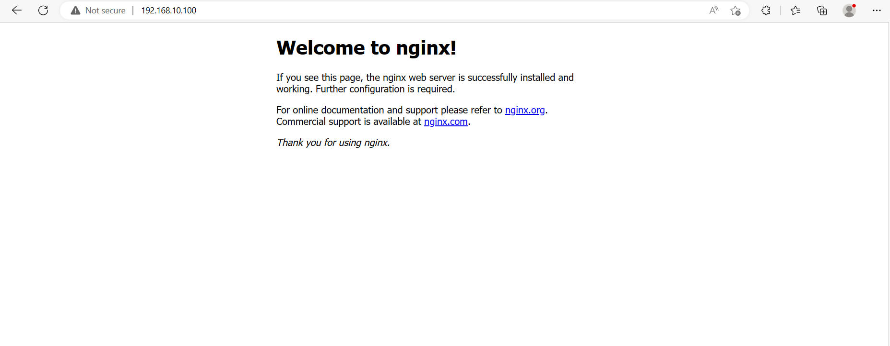

# How to create a Virtual Machine using Vagrant (via Virtual Box)

### First make sure to download Virutal box

https://www.virtualbox.org/wiki/Downloads

Make sure you download the correct version depending on which operating system you have (Windows/ Mac/ Linux, etc.)

As a side note, although version 7 is the latest update, version 6 is the most stable of the recent versions.

### You will also need to download Vagrant

https://developer.hashicorp.com/vagrant/downloads

Again, make sure to download the correct version for the operating system you are using. If you are unsure of which option to use, install AMD64.

To check this has installed properly, open a terminal.  For Window's users, you can do this by clicking on the Windows icon at the bottom of your laptop.

and type in 'command prompt' or 'bash' in the search bar...

In the terminal, type in:

`vagrant`

If it lists common commands, then it has been successfully installed.

### Change into the directory where you want to set up your virtual machine

You do this by using the command:

`cd <directory you would like to go to>`

For example, I want this to be in my tech230_vagrant_intro folder so:

`cd tech230_vagrant_intro`

### Create a Vagrant file

Once in the directory that you want to be in, create a Vagrant file by typing into the terminal:

`vagrant init`

This will create a Vagrantfile. When you click on this there will be a lot of comments.  You can erase them until you are left with just the code.  It should look like this:

### Make a Virtual Machine

Then, to create a virtual machine, type into the terminal:

`vagrant up`

It should look something like this:

Next type into the terminal:

`vagrant ssh`

This generates ssh keys for us and this command should take you into Vagrant.

You will be able to see this has been successful by the change in the name at the beginning of your command prompt.  Mine says 'vagrant@ubuntu-xenial:~$' in green.

In here, we can only use Linux commands, so we have to use the terminal to communicate with the virutal machine.

### Update the packages

In order to grab the latest updates available, we type into the terminal:

`sudo apt-get update`

sudo = super user do (which gives you admin rights.)

apt-get = instructs the computer to go and get these packages

This will find the latest updates available but will not put them into affect.  For this, we will need to...

### Upgrade the packages

We do this by typing into the terminal:

`sudo apt-get upgrade`

When it asks for confirmation, enter 'Y'

If you'd like to skip this step, the command to enter is:

`sudo apt-get upgrade -y`

This makes things faster if you know you definitely want to upgrade.  But although update is considered a safe command (as it doesn't actually affect anything but merely collects information, upgrade has the potential to be damaging, so be sure you want to upgrade, before you confirm this.)

### Installing nginx

Next, we will want to install nginx by typing into the terminal:

`sudo apt-get install nginx -y`

To start nginx:

`sudo systemctl start nginx`

To check the status:

`sudo systemctl status nginx`

This may kick you out of the VM (virtual machine)

If so:

`press control + C`

and then

`vagrant ssh`

This will take you back into the VM.

### To link the VM to an IP address

We need to connect the VM to an address so it knows where to go.

Add:

`config.vm.network"private_network", ip: "192.168.10.100"`

to your Vagrant file

under:

`config.vm.box = "ubuntu/xenial64"`

Your code in Vagrantfile should look like:

And you should be connected!

To check, go to a web browser and type in the ip address into the browser.  So:

`192.168.10.100`

and it should look like this:

Congratulations, you have created a virtual machine and connected this to an IP address!